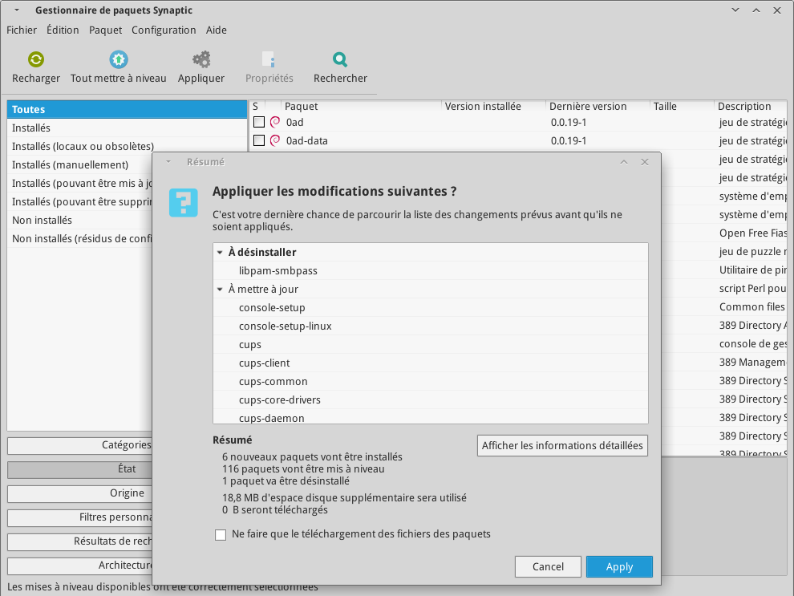
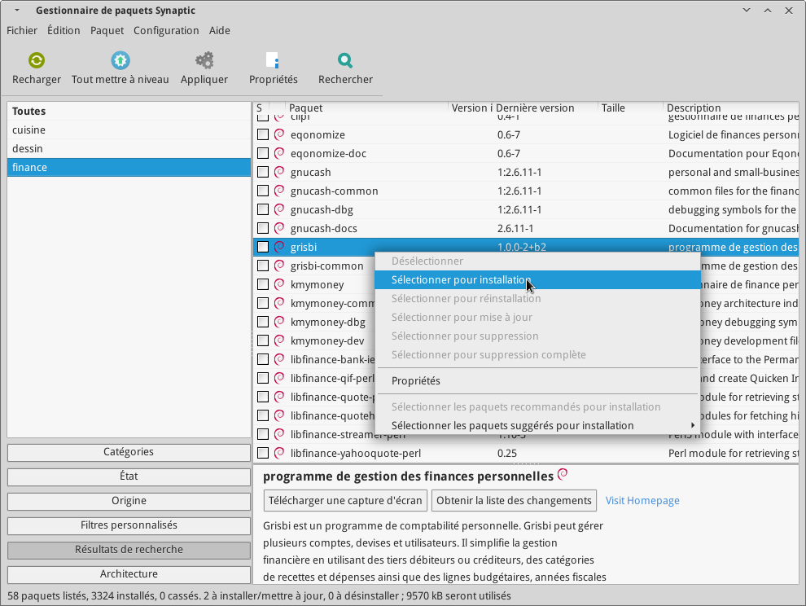

#dbu

Custom quick [Debian GNU/Linux](http://www.debian.org/) installer / live system.

[Debian GNU/Linux](https://en.wikipedia.org/wiki/Debian) is a major and widely used [Linux distribution](https://en.wikipedia.org/wiki/Linux_distribution). [GNU/Linux](https://en.wikipedia.org/wiki/Linux) is a [Free](https://en.wikipedia.org/wiki/Free_software) and open source [operating system](https://en.wikipedia.org/wiki/Operating_system).

-----------------------------------------------------------------------------------------

### Download

**[⬇ Download for 64-bit processors (x86_64)](dbu-1.0-x86_64.torrent)**

**[⬇ Download for 32-bit processors (x86)](dbu-1.0-x86.torrent)**

------------------------------------------

### Required Hardware

  * Computer with x86 or x86_64 processor
  * Memory: min 512MB, recommended 1GB+
  * Hard drive: recommended 10+GB (system), 10+GB (user data).
  * 2GB+ USB drive or DVD-R
  * Optional: access to this documentation
  * Optional: Internet access
  * Optional: external storage (HDD, USB, ...) (backups)

------------------------------------------

### Writing the installation media

#### To USB - From Linux

  * Insert a 2GB+ USB drive
  * Right-click the ISO image file, and click `Open with ... > Disk image writer` (requires `gnome-disk-utility`)
  * Or, using the command line: Identify your USB drive device name (eg. `/dev/sdc`) from your disk utility or using the `lsblk` command; Write the ISO image to the drive using `sudo dd /path/to/your/dbu.iso /dev/sdXXX`.

#### To USB - From Windows

  * Insert a blank 2GB+ USB drive
  * Download [win32diskimager](http://sourceforge.net/projects/win32diskimager/files/latest/download), extract it in a directory, then run the program.
  * `Image file`: select your dbu ISO image.
  * `Device`: Select your USB drive's drive letter.
  * Press `Write`. **Caution, all data on the USB drive will be erased**

#### To DVD

  * Select "burn a disk image" in your disk burning utility (Windows: [InfraRecorder](http://infrarecorder.org/?page_id=5))

------------------------------------------

### Installation

| 💥 |Overwrites your previously installed Operating System! Backup your data to an external drive before continuing! |
|---------|---------|

 * Turn computer off. Insert the installation USB/DVD, turn computer on.
  * Check that the computer BIOS is configured to boot from CD/DVD or USB.
  * On some computers you need to disable [Secure Boot](https://en.wikipedia.org/wiki/Unified_Extensible_Firmware_Interface#Secure_boot) before installing a Linux distribution. See [Disabling Secure Boot in Windows 8](https://github.com/nodiscc/scriptz/blob/master/SHEETS/disabling_secure_boot_in_windows_8.md).
 * In the boot menu, select `Graphical install`
 * Follow the installation procedure

-------------------------------------------------------

## Usage

 * [Installed software documentation](packages.md)
 * `Help` menu inside the application.

-------------------------------------------

#### Configuration

Use the `Settings manager` to configure your desktop or `Options`/`Preferences` inside applications menus.  
Configuration files are generally found in `~/.config` or `/etc/` directories.

------------------------------------------

#### Running programs and working with files

 * _Application Menu_ (bottom left corner or the screen)
 * _Synapse launcher_ (`²` key, begin typing, Use `arrows` and `Tab` keys).
 * _File Manager_
 * _Terminal emulator_ (command line)
 
Your _Home directory_ contains all personal files belonging to your user account on the computer.

------------------------------------------

#### Installing/removing/updating software

_Package management_ allows you to install, remove or upgrade every component of your system (applications, system services, libraries, operating system kernel...).

 * **[All Debian packages](https://packages.debian.org)** (+40 000 packages)

##### Upgrading all software

 * From the [Synaptic](packages/synaptic.md) package manager:
   * click `Reload`, `Mark all upgrades`, `Apply`.
   * Review the proposed changes and `Apply`.



 
 
##### Installing/Removing software

 * Use the `Search` button to search in package names or descriptions.
 * From the [Synaptic](packages/synaptic.md) package manager:
  * Right-click the package to install/remove
  * `Select for installation` or `Select for removal`.
  * Click `Apply` to proceed to installation.

 


------------------------------------------

#### Maintenance

 * **Backup** your data periodically to an external storage.
 * Upgrade installed software.
 * Run `Bleachbit` to clear temporary files and free up disk space.
 * Battery/power: Lower screen brightness! Turn off wifi, bluetooth and other unused hardware. Use hibernation mode (suspend to disk) instead of sleep (suspend to RAM).
 * Performance: Close unused applications, disable unused `Services` and autostart programs in `Session and startup`.
 * Run `Disk utility` to run checks against your disks (automatic every 25 reboots).
 * Clean your computer case from dust every year.


#### Security

 * Do not run untrusted software or commands.
 * Do not copy-paste commands from the web to your terminal emulator.
 * Only install software from your package manager.
 * Upgrade installed software
 * Only enter your administrator password to perform necessary system administration tasks.
 * use strong (long) passwords/phrases.
 * Do not reuse your passwords for different services/machines (use a password manager).
 * Use encrypted communication protocols over insecure networks (SFTP, HTTPS, SSH, OTR, GPG...), use removable drives encryption.
 * Minimize installed/running software.
 * Do not mark untrusted files as executable.

------------------------------------------

#### Keyboard shortcuts

Can be changed through `Settings > Keyboard` and `Settings > Window manager`

 * `²` Open launcher
 * `Win + N` Show/Hide notes
 * `Win + E` File manager
 * `Win + F` Find files
 * `Win + Q` Quit/Power off/restart/sleep
 * `Win + L` Lock desktop
 * `Ctrl + Alt + Suppr` Task manager
 * `Win + T` Terminal emulator
 * `Win + R` Run a command
 * `Win + Esc` Applications menu
 * `Win + Pause` Settings manager
 * `Win + I` Web browser
 * `Win + C` Calculator
 * `Win + A` Alarm clock
 * `Win + M` Mail client
 * `Win + P` Pidgin instant messaging
 * `Alt + Tab` Cycle between windows
 * `Win + D` Show Desktop
 * `Win + Left/Right/Up/Down` Go to left/right/up/down workspace
 * `Alt + F4` Close windows
 * `Alt + F7` Move windows
 * `Alt + F8` Resize windows
 * `Alt + mouse wheel` Zoom/dezoom display

------------------------------------------

#### General documentation

 * [Debian wiki](https://wiki.debian.org/fr/FrontPage)
 * [Arch Linux wiki](https://wiki.archlinux.org/)
 * [Wikipedia](https://en.wikipedia.org/wiki/Main_Page)

#### Forums and communities

<!-- [forums] -->


#### Contributing

 * Write translations
 * Write documentation
 * Contribute code
 * Report bugs, help debugging, provide user support on forums.
 * Create templates and audio/video resources under Free licenses
 * Donate to software projects

#### Reporting bugs

When reporting a bug, please include the following information:

>     * What are you trying to do?
>     * When does the problem happen (actions, mouse clicks, commands...) ?
>     * What is the expected behavior?
>     * What happens instead?
>     * Version of the software and operating system/Linux distribution

Each software's homepage has information on how to report bugs

Use the [Debian Bug Tracking System](https://www.debian.org/Bugs/) for bugs in Debian packages.

#### Customize/Build your own

```
DIRECTORIES

.
├── auto                        #main build configuration
├── config
│   ├── archives                #package mirrors/repositories
│   ├── hooks                   #scripts to run during build
│   ├── includes.binary         #files to include directly in the ISO filesystem
│   ├── includes.chroot         #files to include in the live system's filesystem
│   ├── includes.installer      #files to include in the installer's filesystem
│   ├── package-lists           #packages to install on live system/place in installation media's pool/ directory
│   ├── packages.chroot         #.deb packages to install on live system
│   └── task-lists              #tasksel tasks to install on live system
├── doc     #user documentation
├── scripts #scripts used to generate build configuration, documentation...
└── Makefile #main build automation, dependencies management, etc


```


## License

[GNU GPLv3](LICENSE). Documentation under [CreativeCommons Attribution-ShareAlike](LICENSE)