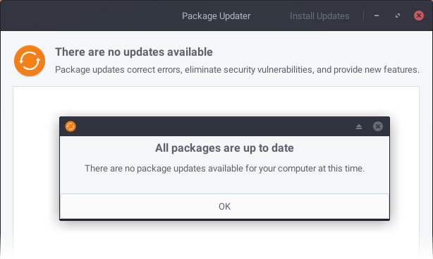
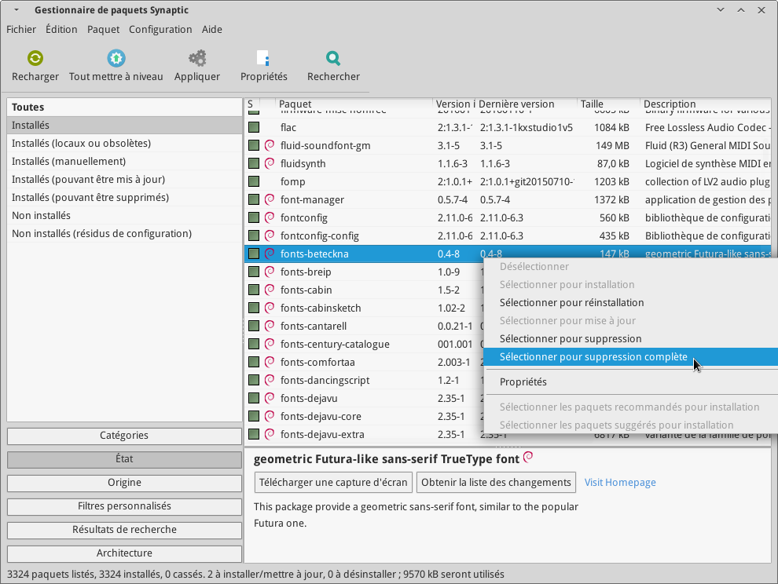

# Usage

 * Refer to each package's [online documentation](packages.md)
 * Use the `Help` menu inside programs.
 * [More documentation](#more-documentation)

-------------------------------------------

#### Running programs and working with files

Your [_Home directory_](https://en.wikipedia.org/wiki/Home_directory) contains personal files belonging to your user account on the computer.

Other program and system files are stored in various locations of the _[File system](https://en.wikipedia.org/wiki/Filesystem_Hierarchy_Standard)._

Use the Applications menu (`Windows + Space` key) or the file manager to open files and run programs.

Use the _Terminal emulator_ to run command-line programs. Use the `man` command to get  help about any installed program, for example `man mpv`. Run `man --apropos --sections=1` to view a list of available manual pages .

-------------------------------------------

#### Configuration

Use the `Settings manager` to configure your desktop, or `Options`/`Preferences` from application menus.  
Other configuration files are generally found in `~/.config` or `/etc/` directories.

------------------------------------------

#### Installing/removing/updating software

The _package management_ system allows you to install, remove or upgrade all components of your system (applications, system services, libraries, operating system...).

 * **[All Debian packages](https://packages.debian.org)** (+40 000 packages)

##### Upgrading all software

A notification will appear when software updates are available.
Run `Package Updater`, click `Install updates` and follow the instructions.

<!--- * From the [Synaptic](packages/synaptic.md) package manager:
   * click `Reload`, `Mark all upgrades`, `Apply`.
   * Review the proposed changes and `Apply`.

 -->

##### Installing/Removing software

Run the `Packages` utility, search for software by name or description, or browse the available categories.

<!-- * Use the `Search` button to search in package names or descriptions.
 * From the [Synaptic](packages/synaptic.md) package manager:
  * Right-click the package to install/remove
  * `Select for installation` or `Select for removal`.
  * Click `Apply` to proceed to installation.

  -->

For convenience other package managers are also available (`synaptic`, `aptitude`, `apt`...).
Most package managers have similar usage:

 * Search for software
 * Select software to install or remove
 * Apply changes

##### Setting up backups

 * Run the **Back In Time** backup utility
 * Select the destination for backups in the 'General' tab (USB/external drive/network location...)
 * Select a schedule for automatic backups (eg. every week),
 * In the the 'Include' tab, add files/directories to backup (eg. Documents, Music...)

Refer to [Backintime](http://backintime.readthedocs.io/en/latest/) documentation for more information.

------------------------------------------

#### Usage recommendations

 * Backup your data periodically to an external storage.
 * Apply software upgrades as soon as possible.
 * Only install software from your package manager.
 * Do not run or install untrusted software or commands.
 * Only enter your administrator password to perform necessary system administration tasks.
 * Do not copy-paste commands from the web to your terminal emulator.
 * Do not mark untrusted files as executable.
 * Use strong (long) passwords/phrases.
 * Do not reuse your passwords for different services (use a password manager).
 * Use encrypted communication protocols (SFTP, HTTPS, SSH, OTR, GPG...), use disk encryption to mitigate theft.
 * Minimize installed/running software.
 * Keep your hardware in good condition.

_Note: The user account created during installation will have `sudo` access (this account can perform administrator tasks, after password verification)_

------------------------------------------

#### Keyboard shortcuts

Can be changed through `Settings > Keyboard` and `Settings > Window manager`

 * `Super/Windows + Space` Open applications menu
 * `Win + N` Show/Hide notes
 * `Win + E` File manager
 * `Win + F` Find files
 * `Win + Q` Quit/Power off/restart/sleep
 * `Win + L` Lock the workstation
 * `Ctrl + Alt + Del` Task manager
 * `Win + T` Terminal emulator
 * `Win + R` Run a command
 * `Win + Esc` Applications menu
 * `Win + Pause` Settings manager
 * `Win + I` Web browser
 * `Win + C` Calculator
 * `Win + A` Alarm clock
 * `Win + M` Mail client
 * `Win + P` Instant messaging client
 * `Alt + Tab` Cycle between windows
 * `Win + D` Show Desktop
 * `Win + Left/Right/Up/Down` Go to left/right/up/down workspace
 * `Alt + F4` Close windows
 * `Alt + F7` Move windows
 * `Alt + F8` Resize windows
 * `Alt + mouse wheel` Zoom-in/out display
 * Applications menu: `!some text` Search for `some text` on the Web
 * Applications menu: `?myfile.pdf` Search for `myfile.pdf` on this computer
 * `Alt + Left click/drag` Move window
 * `Alt + Right click/drag` Resize window

--------------------------------------------

## More Documentation

_Documentation, forums, communities, support channels..._

### Debian/General

 * **[Debian Documentation](https://www.debian.org/doc/)**
 * **[Arch Linux wiki](https://wiki.archlinux.org/)**, **[List of Applications](https://wiki.archlinux.org/index.php/List_of_applications)**, **[Other software lists](https://wiki.archlinux.org/index.php/List_of_applications#See_also)**
 * **[Debian Project Homepage](https://www.debian.org/)**
 * **[Debian Resources](https://wiki.debian.org/DebianResources)** [[➝fr]](https://wiki.debian.org/fr/DebianResources) [[➝de]](https://wiki.debian.org/de/DebianResources) [[➝es]](https://wiki.debian.org/es/DebianResources)
 * Help: **[Debian forums](http://forums.debian.net/)** [[➝fr]](https://www.debian-fr.org/), [IRC](https://wiki.debian.org/IRC), [StackExchange](https://stackexchange.com/search), [ServerFault](https://serverfault.com/), [SuperUser](https://superuser.com/), [UNIX StackExchange](https://unix.stackexchange.com/)
 * [Debian - Wikipedia](https://en.wikipedia.org/wiki/Debian) [[➝fr]](https://fr.wikipedia.org/wiki/Debian) [[➝de]](https://de.wikipedia.org/wiki/Debian) [[➝es]](https://es.wikipedia.org/wiki/Debian)
 * [Debian Social Contract](https://www.debian.org/social_contract) [[➝fr]](https://www.debian.org/social_contract.fr.html) [[➝de]](https://www.debian.org/social_contract.de.html) [[➝es]](https://www.debian.org/social_contract.es.html), [Debian Constitution](https://www.debian.org/devel/constitution)
 * Hardware: [Debian Hardware Compatibility List](http://kmuto.jp/debian/hcl/index.cgi), [Linux Laptop Wiki](http://www.linlap.com/)
 * Debian installation: [Debian CD images](http://cdimage.debian.org/cdimage/), [CD images including firmware](http://cdimage.debian.org/cdimage/unofficial/non-free/cd-including-firmware/), [Installation Guide](https://www.debian.org/releases/stable/amd64/), [Installing Debian step by step](https://debian-handbook.info/browse/stable/sect.installation-steps.html)
 * [Wikipedia](https://en.wikipedia.org/wiki/Main_Page), [Free and open-source software portal](https://en.wikipedia.org/wiki/Portal:Free_and_open-source_software)
 * [Fiches pratiques Linux [fr]](http://www.commentcamarche.net/faq/linux-97)
